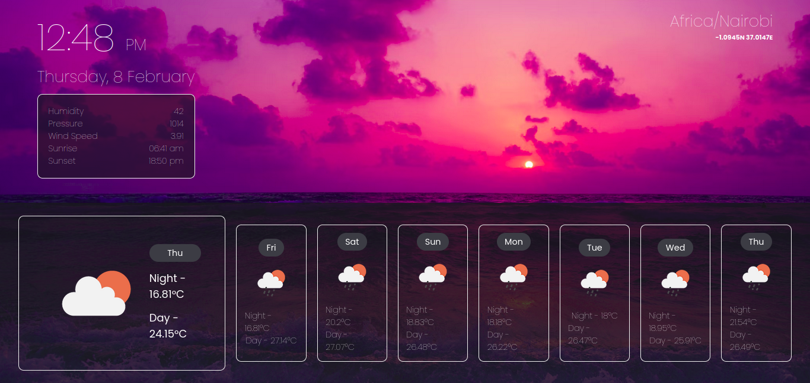

# Weather App Portfolio.

<p align="center">
  <!-- 
</p> -->
This is a simple weather app that displays current weather data and a weather forecast based on geolocation.

## Features

- Displays current weather information including humidity, pressure, wind speed, and sunrise/sunset times.
- Shows a weather forecast for the upcoming days.
- Supports geolocation to get accurate weather information based on the user's location.

## Technologies Used

- HTML
- CSS
- JavaScript
- Jest (for testing)
- Codium AI (for generating unit tests)

## Getting Started

1. **Clone the repository :dna::**

   ```
   git clone https://github.com/Stosh09/weather_app_portfolio.git
   ```

2. **Navigate to the project directory :open_file_folder::**

   ```
   cd weather_app_portfolio
   ```

3. **Install dependencies :gear::**

   ```
   npm install
   npm install --save-dev jest
   npm install --save-dev jest-environment-jsdom
   ```

4. **Run the app:**

   Open `index.html` in your preferred web browser.

## Deployed on GitHub Pages :page_with_curl:

The Weather App is deployed and accessible on GitHub Pages. You can visit it at [https://stosh09.github.io/weather_app_portfolio/](https://stosh09.github.io/weather_app_portfolio/).

## Testing :straight_ruler:

To run tests using Jest:

```
npm test
```

## Project Structure :file_folder:

- `index.html`: The main HTML file for the app.
- `style.css`: Stylesheet for the app.
- `script.js`: JavaScript file containing the main functionality.
- `geolocationMock.js`: Mock file for geolocation in Jest tests.
- `jest.config.js`: Jest configuration file.
- `script.test.js`: Jest test file for testing the script.
- `screenshots`: Directory containing screenshots

## Authors :black_nib:
| [<br><sub>Stosh Odhiambo<br><sup>@Stosh09](https://github.com/Stosh09) | [<br><sub>Ouko Franchez<br><sup>@OukoFranchez](https://github.com/OukoFranchez) |
|:----------------------------------------------------------------------------------------------------------------------------------------------------------------:|:--------------------------------------------------------------------------------------------------------------------------------------------------:|

## Acknowledgments

- Thanks to [OpenWeatherMap](https://openweathermap.org/) for providing the weather data API.
- Unit tests generated using [Codium AI](https://codium.ai/).


## Contributing

Contributions are welcome! Feel free to open an issue or submit a pull request.


